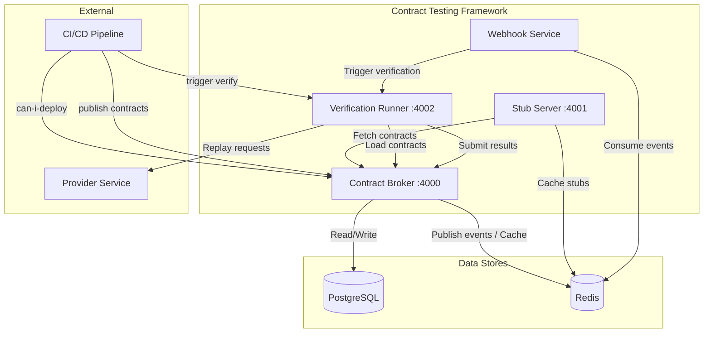
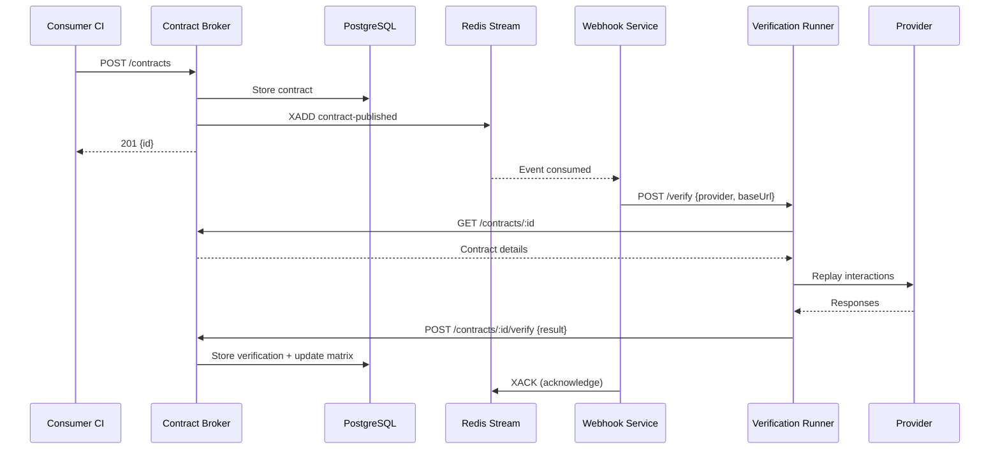

# Design Document: Contract Testing Framework

## Overview

This design describes a production-grade consumer-driven contract testing framework implemented as a TypeScript monorepo. The system enables teams to define API contracts between services, verify providers against those contracts, generate stubs for consumer isolation testing, and track compatibility across service versions via a centralized matrix.

The framework consists of four services communicating over HTTP and Redis Streams:

- **Contract Broker** (port 4000): Central registry for contracts, verification results, and the compatibility matrix.
- **Stub Server** (port 4001): Dynamically generates Express HTTP servers from contracts for consumer isolation testing.
- **Verification Runner** (port 4002): Executes provider verification against stored contracts and reports results.
- **Webhook Service** (background worker): Consumes contract-published events from Redis Stream and triggers automatic provider verification.

### Key Design Decisions

1. **Monorepo with shared packages**: All services share type definitions and utility code, ensuring type safety across boundaries.
2. **PostgreSQL for persistence**: Contracts, verification results, and matrix entries are stored relationally for complex queries (matrix computation, can-i-deploy).
3. **Redis for caching + messaging**: Stub configurations are cached with TTL; Redis Streams provide ordered, durable event delivery for webhooks.
4. **Express.js**: Lightweight HTTP framework for all services, with dynamic server creation for stubs.
5. **Matching rules engine as a pure function**: The core matching logic is side-effect-free, making it ideal for property-based testing.

## Architecture

### Monorepo Layout

```
contract-testing-framework/
├── packages/
│   └── shared/
│       ├── src/
│       │   ├── types/           # Shared TypeScript interfaces
│       │   ├── validation/      # Contract validation logic
│       │   ├── matching/        # Matching rules engine
│       │   └── index.ts
│       ├── package.json
│       └── tsconfig.json
├── services/
│   ├── contract-broker/
│   │   ├── src/
│   │   │   ├── routes/          # Express route handlers
│   │   │   ├── db/              # PostgreSQL queries and migrations
│   │   │   ├── redis/           # Redis client and stream publishing
│   │   │   ├── matrix/          # Compatibility matrix logic
│   │   │   └── app.ts
│   │   ├── Dockerfile
│   │   ├── package.json
│   │   └── tsconfig.json
│   ├── stub-server/
│   │   ├── src/
│   │   │   ├── routes/          # Stub management endpoints
│   │   │   ├── stub-manager/    # Dynamic Express server lifecycle
│   │   │   ├── matcher/         # Request-to-interaction matching
│   │   │   ├── cache/           # Redis caching layer
│   │   │   └── app.ts
│   │   ├── Dockerfile
│   │   ├── package.json
│   │   └── tsconfig.json
│   ├── verification-runner/
│   │   ├── src/
│   │   │   ├── routes/          # Verification API endpoints
│   │   │   ├── runner/          # Verification execution logic
│   │   │   ├── reporter/        # Result submission to broker
│   │   │   └── app.ts
│   │   ├── Dockerfile
│   │   ├── package.json
│   │   └── tsconfig.json
│   └── webhook-service/
│       ├── src/
│       │   ├── consumer/        # Redis Stream consumer
│       │   ├── retry/           # Exponential backoff retry logic
│       │   ├── dedup/           # Duplicate event detection
│       │   └── app.ts
│       ├── Dockerfile
│       ├── package.json
│       └── tsconfig.json
├── k8s/
│   ├── namespace.yaml
│   ├── rbac.yaml
│   ├── network-policies.yaml
│   ├── resource-quotas.yaml
│   ├── pdb.yaml
│   ├── contract-broker/
│   │   ├── deployment.yaml
│   │   └── service.yaml
│   ├── stub-server/
│   │   ├── deployment.yaml
│   │   └── service.yaml
│   ├── verification-runner/
│   │   ├── deployment.yaml
│   │   └── service.yaml
│   ├── webhook-service/
│   │   └── deployment.yaml
│   ├── postgres/
│   │   ├── deployment.yaml
│   │   ├── service.yaml
│   │   └── pvc.yaml
│   └── redis/
│       ├── deployment.yaml
│       ├── service.yaml
│       └── pvc.yaml
├── .github/
│   └── workflows/
│       └── ci.yaml
├── docker-compose.yaml
├── package.json                  # Root workspace config
├── tsconfig.base.json
└── jest.config.base.ts
```

### Service Communication Diagram



### Sequence Diagram: Contract Publish → Webhook Verification



## Components and Interfaces

### Shared Package (`packages/shared`)

The shared package exports all type definitions, the matching rules engine, and contract validation logic.

```typescript
// packages/shared/src/index.ts
export * from './types';
export * from './matching/engine';
export * from './validation/contract-validator';
```

### Contract Broker API

| Method | Path | Description |
|--------|------|-------------|
| POST | /contracts | Publish a new contract |
| GET | /contracts | List all active contracts (metadata only) |
| GET | /contracts/:id | Get full contract by ID |
| GET | /contracts/consumer/:name | Get contracts by consumer |
| GET | /contracts/provider/:name | Get contracts by provider |
| DELETE | /contracts/:id | Archive a contract |
| POST | /contracts/:id/verify | Submit verification result |
| GET | /matrix | Get compatibility matrix |
| GET | /matrix/can-i-deploy | Check deploy safety |
| GET | /health | Liveness probe |
| GET | /ready | Readiness probe |

### Stub Server API

| Method | Path | Description |
|--------|------|-------------|
| POST | /stubs | Create a stub from a contract |
| GET | /stubs | List active stubs |
| DELETE | /stubs/:id | Destroy a stub |
| GET | /health | Liveness probe |
| GET | /ready | Readiness probe |

### Verification Runner API

| Method | Path | Description |
|--------|------|-------------|
| POST | /verify | Trigger verification |
| GET | /verify/:id/status | Get verification job status |
| GET | /results | List verification results (paginated) |
| GET | /health | Liveness probe |
| GET | /ready | Readiness probe |

### Component Interactions

```typescript
// Contract Broker internal modules
interface ContractRepository {
  create(contract: Contract): Promise<Contract>;
  findById(id: string): Promise<Contract | null>;
  findActive(): Promise<ContractSummary[]>;
  findByConsumer(name: string): Promise<ContractSummary[]>;
  findByProvider(name: string): Promise<ContractSummary[]>;
  archive(id: string): Promise<Contract | null>;
  upsert(contract: Contract): Promise<Contract>;
}

interface VerificationResultRepository {
  store(contractId: string, result: VerificationResult): Promise<void>;
  findByProvider(provider: string, page: number, pageSize: number): Promise<PaginatedResult<VerificationResult>>;
}

interface MatrixService {
  getMatrix(service?: string): Promise<MatrixEntry[]>;
  canIDeploy(service: string, version: string): Promise<CanIDeployResult>;
  updateEntry(contractId: string, result: VerificationResult): Promise<void>;
}

interface EventPublisher {
  publishContractEvent(event: ContractPublishedEvent): Promise<boolean>;
}

// Stub Server internal modules
interface StubManager {
  create(contractId: string): Promise<StubInfo>;
  list(): Promise<StubInfo[]>;
  destroy(stubId: string): Promise<boolean>;
}

interface StubCache {
  get(contractId: string): Promise<Contract | null>;
  set(contractId: string, contract: Contract): Promise<void>;
  invalidate(contractId: string): Promise<void>;
}

// Verification Runner internal modules
interface VerificationExecutor {
  run(job: VerificationJob): Promise<VerificationResult>;
}

interface ProviderStateSetup {
  invoke(callbackUrl: string, state: ProviderState): Promise<void>;
}

// Webhook Service internal modules
interface EventConsumer {
  start(): Promise<void>;
  stop(): Promise<void>;
}

interface RetryPolicy {
  execute<T>(fn: () => Promise<T>, maxAttempts: number): Promise<T>;
}
```

## Data Models

### TypeScript Interfaces

```typescript
// packages/shared/src/types/contract.ts

export interface Contract {
  id: string;                    // UUID v4
  consumer: string;              // max 128 chars
  provider: string;              // max 128 chars
  version: string;               // semver format (major.minor.patch)
  status: 'active' | 'archived';
  interactions: Interaction[];
  createdAt: Date;
  updatedAt: Date;
}

export interface ContractSummary {
  id: string;
  consumer: string;
  provider: string;
  version: string;
  status: 'active' | 'archived';
  createdAt: Date;
  updatedAt: Date;
}

export interface Interaction {
  description: string;           // at least 1 non-whitespace char
  providerStates: ProviderState[];
  request: RequestSpec;
  response: ResponseSpec;
  matchingRules: MatchingRule[];
}

export interface RequestSpec {
  method: HttpMethod;
  path: string;                  // starts with "/"
  headers?: Record<string, string>;
  query?: Record<string, string>;
  body?: unknown;
}

export type HttpMethod = 'GET' | 'POST' | 'PUT' | 'PATCH' | 'DELETE' | 'HEAD' | 'OPTIONS';

export interface ResponseSpec {
  status: number;                // 100-599
  headers?: Record<string, string>;
  body?: unknown;
}

export interface MatchingRule {
  path: string;                  // JSON path starting with "$"
  type: MatchingRuleType;
  value: unknown;                // non-null
}

export type MatchingRuleType = 'exact' | 'type' | 'regex' | 'include';

export interface ProviderState {
  name: string;
  params?: Record<string, unknown>;
}
```

```typescript
// packages/shared/src/types/verification.ts

export interface VerificationResult {
  id: string;                    // UUID v4
  contractId: string;
  providerName: string;
  providerVersion: string;
  success: boolean;
  interactionResults: InteractionResult[];
  executedAt: Date;
}

export interface InteractionResult {
  interactionDescription: string;
  success: boolean;
  mismatches: Mismatch[];
}

export interface Mismatch {
  path: string;                  // JSON path or descriptor
  expected: unknown;
  actual: unknown;
  type: MismatchType;
}

export type MismatchType = 'status' | 'header' | 'body' | 'missing';
```

```typescript
// packages/shared/src/types/matrix.ts

export interface MatrixEntry {
  consumerName: string;
  consumerVersion: string;
  providerName: string;
  providerVersion: string;
  status: 'success' | 'failure' | 'unverified';
  verifiedAt: Date | null;
}

export interface CanIDeployResult {
  deployable: boolean;
  reason?: string;
  failingContracts?: FailingContract[];
}

export interface FailingContract {
  consumerName: string;
  providerName: string;
  consumerVersion: string;
}
```

```typescript
// packages/shared/src/types/events.ts

export interface ContractPublishedEvent {
  contractId: string;
  consumer: string;
  provider: string;
  version: string;
  timestamp: Date;
}

export interface StubInfo {
  id: string;
  contractId: string;
  port: number;
  consumer: string;
  provider: string;
  createdAt: Date;
}

export interface VerificationJob {
  id: string;
  providerName: string;
  providerVersion: string;
  providerBaseUrl: string;
  stateCallbackUrl?: string;
  status: 'pending' | 'running' | 'completed' | 'failed';
  contractIds: string[];
}

export interface PaginatedResult<T> {
  data: T[];
  page: number;
  pageSize: number;
  total: number;
  totalPages: number;
}
```

### Database Schema (PostgreSQL)

```sql
-- Contracts table
CREATE TABLE contracts (
    id UUID PRIMARY KEY DEFAULT gen_random_uuid(),
    consumer VARCHAR(128) NOT NULL,
    provider VARCHAR(128) NOT NULL,
    version VARCHAR(64) NOT NULL,
    status VARCHAR(16) NOT NULL DEFAULT 'active' CHECK (status IN ('active', 'archived')),
    created_at TIMESTAMPTZ NOT NULL DEFAULT NOW(),
    updated_at TIMESTAMPTZ NOT NULL DEFAULT NOW(),
    UNIQUE (consumer, provider, version)
);

CREATE INDEX idx_contracts_consumer ON contracts(consumer) WHERE status = 'active';
CREATE INDEX idx_contracts_provider ON contracts(provider) WHERE status = 'active';
CREATE INDEX idx_contracts_status ON contracts(status);

-- Interactions table
CREATE TABLE interactions (
    id UUID PRIMARY KEY DEFAULT gen_random_uuid(),
    contract_id UUID NOT NULL REFERENCES contracts(id) ON DELETE CASCADE,
    description TEXT NOT NULL,
    request_method VARCHAR(8) NOT NULL,
    request_path TEXT NOT NULL,
    request_headers JSONB,
    request_query JSONB,
    request_body JSONB,
    response_status INTEGER NOT NULL CHECK (response_status BETWEEN 100 AND 599),
    response_headers JSONB,
    response_body JSONB,
    sort_order INTEGER NOT NULL DEFAULT 0
);

CREATE INDEX idx_interactions_contract ON interactions(contract_id);

-- Matching rules table
CREATE TABLE matching_rules (
    id UUID PRIMARY KEY DEFAULT gen_random_uuid(),
    interaction_id UUID NOT NULL REFERENCES interactions(id) ON DELETE CASCADE,
    json_path TEXT NOT NULL,
    rule_type VARCHAR(16) NOT NULL CHECK (rule_type IN ('exact', 'type', 'regex', 'include')),
    value JSONB NOT NULL
);

CREATE INDEX idx_matching_rules_interaction ON matching_rules(interaction_id);

-- Provider states table
CREATE TABLE provider_states (
    id UUID PRIMARY KEY DEFAULT gen_random_uuid(),
    interaction_id UUID NOT NULL REFERENCES interactions(id) ON DELETE CASCADE,
    name TEXT NOT NULL,
    params JSONB
);

CREATE INDEX idx_provider_states_interaction ON provider_states(interaction_id);

-- Verification results table
CREATE TABLE verification_results (
    id UUID PRIMARY KEY DEFAULT gen_random_uuid(),
    contract_id UUID NOT NULL REFERENCES contracts(id) ON DELETE CASCADE,
    provider_name VARCHAR(128) NOT NULL,
    provider_version VARCHAR(64) NOT NULL,
    success BOOLEAN NOT NULL,
    executed_at TIMESTAMPTZ NOT NULL DEFAULT NOW()
);

CREATE INDEX idx_verification_results_contract ON verification_results(contract_id);
CREATE INDEX idx_verification_results_provider ON verification_results(provider_name);

-- Interaction results table
CREATE TABLE interaction_results (
    id UUID PRIMARY KEY DEFAULT gen_random_uuid(),
    verification_result_id UUID NOT NULL REFERENCES verification_results(id) ON DELETE CASCADE,
    interaction_description TEXT NOT NULL,
    success BOOLEAN NOT NULL
);

CREATE INDEX idx_interaction_results_verification ON interaction_results(verification_result_id);

-- Mismatches table
CREATE TABLE mismatches (
    id UUID PRIMARY KEY DEFAULT gen_random_uuid(),
    interaction_result_id UUID NOT NULL REFERENCES interaction_results(id) ON DELETE CASCADE,
    json_path TEXT NOT NULL,
    expected JSONB,
    actual JSONB,
    mismatch_type VARCHAR(16) NOT NULL CHECK (mismatch_type IN ('status', 'header', 'body', 'missing'))
);

CREATE INDEX idx_mismatches_interaction_result ON mismatches(interaction_result_id);

-- Matrix entries table
CREATE TABLE matrix_entries (
    id UUID PRIMARY KEY DEFAULT gen_random_uuid(),
    consumer_name VARCHAR(128) NOT NULL,
    consumer_version VARCHAR(64) NOT NULL,
    provider_name VARCHAR(128) NOT NULL,
    provider_version VARCHAR(64) NOT NULL,
    status VARCHAR(16) NOT NULL DEFAULT 'unverified' CHECK (status IN ('success', 'failure', 'unverified')),
    verified_at TIMESTAMPTZ,
    verification_result_id UUID REFERENCES verification_results(id),
    UNIQUE (consumer_name, consumer_version, provider_name, provider_version)
);

CREATE INDEX idx_matrix_consumer ON matrix_entries(consumer_name);
CREATE INDEX idx_matrix_provider ON matrix_entries(provider_name);
```

### Redis Data Structures

| Key Pattern | Type | Description | TTL |
|-------------|------|-------------|-----|
| `stub:config:{contractId}` | String (JSON) | Cached contract for stub generation | 5 min |
| `webhook:processed:{contractId}` | String | Deduplication flag for processed events | 1 hour |
| `contract-events` | Stream | Contract-published events stream | N/A |
| `contract-events-dlq` | Stream | Dead letter queue for failed events | N/A |

### Core Algorithms

#### Matching Rules Engine

The matching rules engine is a pure function that evaluates a response value at a given JSON path against a matching rule.

```typescript
// packages/shared/src/matching/engine.ts

import jp from 'jsonpath';

export type MatchResult = { pass: true } | { pass: false; mismatch: Mismatch };

export function evaluateMatchingRule(
  rule: MatchingRule,
  actualBody: unknown
): MatchResult {
  const values = jp.query(actualBody, rule.path);
  
  if (values.length === 0) {
    return {
      pass: false,
      mismatch: {
        path: rule.path,
        expected: rule.value,
        actual: undefined,
        type: 'missing'
      }
    };
  }

  const actual = values[0];

  switch (rule.type) {
    case 'exact':
      return deepEqual(actual, rule.value)
        ? { pass: true }
        : { pass: false, mismatch: { path: rule.path, expected: rule.value, actual, type: 'body' } };

    case 'type':
      return sameTypeCategory(actual, rule.value)
        ? { pass: true }
        : { pass: false, mismatch: { path: rule.path, expected: typeOf(rule.value), actual: typeOf(actual), type: 'body' } };

    case 'regex': {
      let regex: RegExp;
      try {
        regex = new RegExp(`^(?:${rule.value as string})$`);
      } catch {
        return { pass: false, mismatch: { path: rule.path, expected: rule.value, actual: 'invalid regex pattern', type: 'body' } };
      }
      const strValue = toStringRepresentation(actual);
      return regex.test(strValue)
        ? { pass: true }
        : { pass: false, mismatch: { path: rule.path, expected: rule.value, actual: strValue, type: 'body' } };
    }

    case 'include': {
      const strActual = toStringRepresentation(actual);
      const substring = rule.value as string;
      return strActual.includes(substring)
        ? { pass: true }
        : { pass: false, mismatch: { path: rule.path, expected: `contains "${substring}"`, actual: strActual, type: 'body' } };
    }
  }
}

function toStringRepresentation(value: unknown): string {
  if (typeof value === 'string') return value;
  return JSON.stringify(value);
}

function typeOf(value: unknown): string {
  if (value === null) return 'null';
  if (Array.isArray(value)) return 'array';
  return typeof value;
}

function sameTypeCategory(a: unknown, b: unknown): boolean {
  return typeOf(a) === typeOf(b);
}

function deepEqual(a: unknown, b: unknown): boolean {
  if (a === b) return true;
  if (a === null || b === null) return false;
  if (typeof a !== typeof b) return false;
  
  if (Array.isArray(a) && Array.isArray(b)) {
    if (a.length !== b.length) return false;
    return a.every((item, i) => deepEqual(item, b[i]));
  }
  
  if (typeof a === 'object' && typeof b === 'object') {
    const keysA = Object.keys(a as object);
    const keysB = Object.keys(b as object);
    if (keysA.length !== keysB.length) return false;
    return keysA.every(key => 
      keysB.includes(key) && deepEqual((a as Record<string, unknown>)[key], (b as Record<string, unknown>)[key])
    );
  }
  
  return false;
}
```

#### Stub Request Matching Algorithm

```typescript
// services/stub-server/src/matcher/request-matcher.ts

interface MatchScore {
  interaction: Interaction;
  score: number;
}

export function findBestMatch(
  request: IncomingRequest,
  interactions: Interaction[]
): Interaction | null {
  const scores: MatchScore[] = [];

  for (const interaction of interactions) {
    const score = computeMatchScore(request, interaction);
    if (score > 0) {
      scores.push({ interaction, score });
    }
  }

  if (scores.length === 0) return null;
  
  scores.sort((a, b) => b.score - a.score);
  return scores[0].interaction;
}

function computeMatchScore(request: IncomingRequest, interaction: Interaction): number {
  let score = 0;

  // Method match (required, case-insensitive)
  if (request.method.toUpperCase() !== interaction.request.method.toUpperCase()) {
    return 0;
  }
  score += 1;

  // Path match (required, with wildcard support for :params)
  if (!pathMatches(request.path, interaction.request.path)) {
    return 0;
  }
  score += 2;

  // Header match (optional but adds score)
  if (interaction.request.headers) {
    if (!headersMatch(request.headers, interaction.request.headers)) {
      return 0;
    }
    score += 1;
  }

  // Query match (optional but adds score)
  if (interaction.request.query) {
    if (!queryMatches(request.query, interaction.request.query)) {
      return 0;
    }
    score += 1;
  }

  // Body match via matching rules (optional but adds score)
  if (interaction.matchingRules.length > 0 && request.body) {
    const bodyMatches = interaction.matchingRules.every(
      rule => evaluateMatchingRule(rule, request.body).pass
    );
    if (!bodyMatches) return 0;
    score += interaction.matchingRules.length;
  }

  return score;
}

function pathMatches(requestPath: string, interactionPath: string): boolean {
  const reqSegments = requestPath.split('/').filter(Boolean);
  const intSegments = interactionPath.split('/').filter(Boolean);
  
  if (reqSegments.length !== intSegments.length) return false;
  
  return intSegments.every((seg, i) => 
    seg.startsWith(':') ? reqSegments[i].length > 0 : seg === reqSegments[i]
  );
}

function headersMatch(
  requestHeaders: Record<string, string>,
  requiredHeaders: Record<string, string>
): boolean {
  const normalizedRequest = Object.fromEntries(
    Object.entries(requestHeaders).map(([k, v]) => [k.toLowerCase(), v])
  );
  return Object.entries(requiredHeaders).every(([key, value]) => 
    normalizedRequest[key.toLowerCase()] === value
  );
}

function queryMatches(
  requestQuery: Record<string, string>,
  requiredQuery: Record<string, string>
): boolean {
  return Object.entries(requiredQuery).every(([key, value]) => 
    requestQuery[key] === value
  );
}
```

#### Verification Flow

```typescript
// services/verification-runner/src/runner/executor.ts

export async function executeVerification(job: VerificationJob): Promise<VerificationResult> {
  const interactionResults: InteractionResult[] = [];

  for (const contractId of job.contractIds) {
    const contract = await brokerClient.getContract(contractId);
    
    for (const interaction of contract.interactions) {
      const result = await verifyInteraction(job, interaction);
      interactionResults.push(result);
    }
  }

  const success = interactionResults.every(r => r.success);
  
  return {
    id: uuid(),
    contractId: job.contractIds[0],
    providerName: job.providerName,
    providerVersion: job.providerVersion,
    success,
    interactionResults,
    executedAt: new Date()
  };
}

async function verifyInteraction(
  job: VerificationJob,
  interaction: Interaction
): Promise<InteractionResult> {
  // 1. Setup provider states
  if (interaction.providerStates.length > 0 && job.stateCallbackUrl) {
    for (const state of interaction.providerStates) {
      try {
        await setupProviderState(job.stateCallbackUrl, state, 10_000);
      } catch (error) {
        return {
          interactionDescription: interaction.description,
          success: false,
          mismatches: [{ path: '', expected: 'provider state setup', actual: error.message, type: 'missing' }]
        };
      }
    }
  }

  // 2. Replay request
  let response: ProviderResponse;
  try {
    response = await replayRequest(job.providerBaseUrl, interaction.request, 30_000);
  } catch (error) {
    return {
      interactionDescription: interaction.description,
      success: false,
      mismatches: [{ path: '', expected: 'connection', actual: error.message, type: 'missing' }]
    };
  }

  // 3. Compare response
  const mismatches = compareResponse(response, interaction.response, interaction.matchingRules);
  
  return {
    interactionDescription: interaction.description,
    success: mismatches.length === 0,
    mismatches
  };
}

function compareResponse(
  actual: ProviderResponse,
  expected: ResponseSpec,
  matchingRules: MatchingRule[]
): Mismatch[] {
  const mismatches: Mismatch[] = [];

  // Status check
  if (actual.status !== expected.status) {
    mismatches.push({
      path: '$.status',
      expected: expected.status,
      actual: actual.status,
      type: 'status'
    });
  }

  // Header checks
  if (expected.headers) {
    for (const [key, value] of Object.entries(expected.headers)) {
      const actualValue = actual.headers[key.toLowerCase()];
      if (actualValue !== value) {
        mismatches.push({
          path: `$.headers.${key}`,
          expected: value,
          actual: actualValue ?? null,
          type: 'header'
        });
      }
    }
  }

  // Body checks via matching rules
  if (matchingRules.length > 0) {
    for (const rule of matchingRules) {
      const result = evaluateMatchingRule(rule, actual.body);
      if (!result.pass) {
        mismatches.push(result.mismatch);
      }
    }
  } else if (expected.body !== undefined) {
    // Default to exact match when no rules defined
    if (!deepEqual(actual.body, expected.body)) {
      mismatches.push({
        path: '$.body',
        expected: expected.body,
        actual: actual.body,
        type: 'body'
      });
    }
  }

  return mismatches;
}
```

#### Compatibility Matrix Computation

```typescript
// services/contract-broker/src/matrix/matrix-service.ts

export async function computeMatrix(service?: string): Promise<MatrixEntry[]> {
  // Query directly from the matrix_entries table
  // The table is incrementally updated on each verification submission
  let query = 'SELECT * FROM matrix_entries';
  const params: string[] = [];
  
  if (service) {
    query += ' WHERE consumer_name = $1 OR provider_name = $1';
    params.push(service);
  }
  
  return db.query(query, params);
}

export async function canIDeploy(service: string, version: string): Promise<CanIDeployResult> {
  // 1. Find all active contracts involving this service
  const asConsumer = await contractRepo.findByConsumer(service);
  const asProvider = await contractRepo.findByProvider(service);
  
  if (asConsumer.length === 0 && asProvider.length === 0) {
    return { deployable: true, reason: 'No contracts found for this service' };
  }

  const failingContracts: FailingContract[] = [];

  // 2. For contracts where service is consumer with given version
  for (const contract of asConsumer.filter(c => c.version === version)) {
    const entry = await getMatrixEntry(contract.consumer, version, contract.provider);
    if (!entry || entry.status !== 'success') {
      failingContracts.push({
        consumerName: contract.consumer,
        providerName: contract.provider,
        consumerVersion: version
      });
    }
  }

  // 3. For contracts where service is provider
  for (const contract of asProvider) {
    const entry = await getMatrixEntry(contract.consumer, contract.version, service);
    if (!entry || entry.status !== 'success') {
      failingContracts.push({
        consumerName: contract.consumer,
        providerName: contract.provider,
        consumerVersion: contract.version
      });
    }
  }

  return {
    deployable: failingContracts.length === 0,
    failingContracts: failingContracts.length > 0 ? failingContracts : undefined
  };
}
```

#### Exponential Backoff Retry (Webhook Service)

```typescript
// services/webhook-service/src/retry/retry-policy.ts

export interface RetryConfig {
  maxAttempts: number;
  initialDelayMs: number;
  multiplier: number;
}

const DEFAULT_CONFIG: RetryConfig = {
  maxAttempts: 3,
  initialDelayMs: 1000,
  multiplier: 2,
};

export async function withRetry<T>(
  fn: () => Promise<T>,
  config: RetryConfig = DEFAULT_CONFIG
): Promise<T> {
  let lastError: Error | undefined;
  let delay = config.initialDelayMs;

  for (let attempt = 1; attempt <= config.maxAttempts; attempt++) {
    try {
      return await fn();
    } catch (error) {
      lastError = error as Error;
      if (attempt < config.maxAttempts) {
        await sleep(delay);
        delay *= config.multiplier;
      }
    }
  }

  throw lastError;
}

function sleep(ms: number): Promise<void> {
  return new Promise(resolve => setTimeout(resolve, ms));
}
```

## Infrastructure

### Redis Caching Strategy

- **Stub configurations**: Cached as JSON under `stub:config:{contractId}` with a 5-minute TTL. On contract update, the broker publishes an invalidation message; the stub server listens and evicts the key.
- **Deduplication**: Webhook service stores `webhook:processed:{contractId}` keys with a 1-hour TTL to prevent duplicate verification triggers.

### Redis Stream Configuration

- Stream name: `contract-events`
- Consumer group: `webhook-workers`
- Dead letter queue: `contract-events-dlq`
- Events are acknowledged (XACK) only after successful processing or after moving to the DLQ.
- Ordering is preserved per consumer-provider pair using a single consumer per group (FIFO semantics within a partition).

### Docker Setup

Each service has its own `Dockerfile` using a multi-stage build:

```dockerfile
# Stage 1: Build
FROM node:20-alpine AS builder
WORKDIR /app
COPY package.json pnpm-lock.yaml pnpm-workspace.yaml ./
COPY packages/shared/package.json packages/shared/
COPY services/<service>/package.json services/<service>/
RUN corepack enable && pnpm install --frozen-lockfile
COPY packages/shared/ packages/shared/
COPY services/<service>/ services/<service>/
RUN pnpm --filter @contract-testing/shared build
RUN pnpm --filter @contract-testing/<service> build

# Stage 2: Production
FROM node:20-alpine
WORKDIR /app
RUN addgroup -g 1001 -S appgroup && adduser -S appuser -u 1001 -G appgroup
COPY --from=builder /app/services/<service>/dist ./dist
COPY --from=builder /app/node_modules ./node_modules
USER appuser
EXPOSE <port>
CMD ["node", "dist/app.js"]
```

`docker-compose.yaml` orchestrates local development with all services, PostgreSQL, and Redis.

### Kubernetes Deployment Architecture

| Resource | Description |
|----------|-------------|
| Namespace | `contract-testing` — isolates all resources |
| RBAC | Per-service ServiceAccounts with minimal permissions |
| NetworkPolicy | Default-deny ingress + explicit allow rules per service |
| ResourceQuota | Namespace-level CPU/memory caps |
| PDB | `minAvailable: 1` for each stateless service |
| Deployments | 2 replicas for stateless services; 1 replica for PostgreSQL/Redis |
| Services | ClusterIP for internal communication |
| Probes | Liveness → `/health`; Readiness → `/ready` with 5s timeout |

## Error Handling

### Service-Level Error Handling

| Service | Error Scenario | Handling Strategy |
|---------|---------------|-------------------|
| Contract Broker | PostgreSQL unavailable | Return 503 on `/ready`; queued writes fail with 500 and structured error |
| Contract Broker | Redis unavailable | Log warning, continue (contract still stored); `/ready` returns 503 |
| Contract Broker | Invalid contract payload | Return 400 with validation errors listing each failed field |
| Stub Server | Contract not found | Return 404 with message |
| Stub Server | Port allocation failure | Return 500 with allocation error |
| Stub Server | Redis unavailable | Fall back to in-memory cache; `/ready` returns 503 |
| Verification Runner | Provider unreachable | Mark verification as failed with connectivity error |
| Verification Runner | Provider state setup timeout (>10s) | Mark interaction as failed with provider state error |
| Verification Runner | Provider response timeout (>30s) | Mark verification as failed |
| Webhook Service | Verification trigger failure | Retry with exponential backoff (3 attempts) |
| Webhook Service | All retries exhausted | Move event to DLQ, log failure details |

### Error Response Format

All services use a consistent error response format:

```typescript
interface ErrorResponse {
  error: {
    code: string;           // e.g., "VALIDATION_ERROR", "NOT_FOUND"
    message: string;        // Human-readable description
    details?: unknown[];    // Array of specific validation failures
  };
}
```

### Graceful Shutdown

All services implement graceful shutdown:
1. Stop accepting new requests
2. Complete in-flight requests (30s deadline)
3. Close database/Redis connections
4. Exit process

## Correctness Properties

*A property is a characteristic or behavior that should hold true across all valid executions of a system — essentially, a formal statement about what the system should do. Properties serve as the bridge between human-readable specifications and machine-verifiable correctness guarantees.*

### Property 1: Contract Serialization Round-Trip

*For any* valid Contract object (with all fields: consumer, provider, version, interactions containing matching rules and provider states), serializing to JSON via `JSON.stringify` and deserializing via `JSON.parse` SHALL produce an object that is deeply equal to the original in all fields, including matching rule types, paths (character-for-character), and values (same JavaScript type).

**Validates: Requirements 16.1, 16.2, 16.3**

### Property 2: Contract Storage Round-Trip

*For any* valid Contract object stored to PostgreSQL and subsequently retrieved by ID, the retrieved contract SHALL be deeply equal to the original in all fields: interactions (including descriptions, request specs, response specs), matching rules (type, path, value), and provider states (name, params).

**Validates: Requirements 11.5**

### Property 3: Contract Validation Correctness

*For any* contract submission, the validation SHALL pass if and only if: (a) consumer and provider names are non-empty strings of at most 128 characters, (b) version conforms to semantic versioning (major.minor.patch), (c) each interaction has a description with at least 1 non-whitespace character, a request spec, and a response spec, (d) each request spec has a valid HTTP method and a path starting with "/", (e) each response spec has a status integer in [100, 599], and (f) each matching rule has a JSON path starting with "$", a supported type, and a non-null value.

**Validates: Requirements 11.1, 11.2, 11.3, 11.4, 1.7**

### Property 4: Exact Matching Deep Equality

*For any* two JSON values `a` and `b`, applying a matching rule of type "exact" with expected value `a` to actual value `b` SHALL pass if and only if `a` and `b` are deeply equal (identical types, identical primitive values, arrays equal in length and element order, objects equal in key sets and corresponding values regardless of key order).

**Validates: Requirements 5.1**

### Property 5: Type Matching Category Check

*For any* two JSON values `a` and `b`, applying a matching rule of type "type" with expected value `a` to actual value `b` SHALL pass if and only if `typeOf(a) === typeOf(b)` where type categories are: "string", "number", "boolean", "null", "array", "object" (arrays and objects are distinct).

**Validates: Requirements 5.2**

### Property 6: Regex Matching with Full-String Anchoring

*For any* string value `s` and valid regular expression pattern `p`, applying a matching rule of type "regex" with pattern `p` to value `s` SHALL pass if and only if `new RegExp("^(?:" + p + ")$").test(s)` is true (implicit full-string anchoring).

**Validates: Requirements 5.3**

### Property 7: Include Matching Substring Check

*For any* string value `s` and substring `sub`, applying a matching rule of type "include" with value `sub` to actual value `s` SHALL pass if and only if `s.includes(sub)` is true (case-sensitive).

**Validates: Requirements 5.4**

### Property 8: Missing JSON Path Produces Missing Mismatch

*For any* JSON object `obj` and JSON path expression `path` that resolves to zero values in `obj`, applying any matching rule referencing `path` SHALL report a mismatch with type "missing".

**Validates: Requirements 5.6**

### Property 9: Matching Rules Determinism

*For any* valid matching rule and any JSON value, evaluating the matching rule against that value twice SHALL produce the same pass/fail result and the same mismatch details (if any).

**Validates: Requirements 5.7**

### Property 10: Non-String Coercion for Regex and Include

*For any* non-string JSON value `v` (number, boolean, object, array, null), applying a regex or include matching rule SHALL operate on `JSON.stringify(v)` as the string representation.

**Validates: Requirements 5.9**

### Property 11: Can-I-Deploy Correctness

*For any* service name and version, and any set of active contracts involving that service (as consumer or provider), the can-i-deploy check SHALL return `deployable: true` if and only if every relevant contract has a successful verification result for the specified version. If any contract lacks a verification result or has a failed verification, it SHALL return `deployable: false` with a list identifying each failing or unverified contract.

**Validates: Requirements 7.2, 7.3**

### Property 12: Stub Path Matching with Wildcards

*For any* interaction path pattern containing literal segments and `:param` wildcard segments, and any request path, the path matcher SHALL match if and only if the paths have the same number of segments, all literal segments match exactly, and all wildcard segments correspond to non-empty values in the request path.

**Validates: Requirements 13.2**

### Property 13: Stub Header Matching Case-Insensitivity

*For any* set of required headers defined in an interaction and any incoming request, the header matcher SHALL pass if and only if every required header name is present in the request (case-insensitive name comparison) with the expected value, regardless of any additional headers in the request.

**Validates: Requirements 13.3**

### Property 14: Stub Query Parameter Subset Matching

*For any* set of required query parameters defined in an interaction and any incoming request, the query matcher SHALL pass if and only if every required parameter is present in the request with exactly the same value (case-sensitive), regardless of additional parameters in the request.

**Validates: Requirements 13.4**

### Property 15: Stub Specificity Selection

*For any* set of interactions where multiple could match an incoming request, the stub SHALL select the interaction that satisfies the most matching criteria (method + path + headers + query + body rules), i.e., the one with the highest match score.

**Validates: Requirements 13.6**

### Property 16: Most Recent Verification Retained

*For any* sequence of verification result submissions for the same consumer-version and provider-version pair, the compatibility matrix SHALL retain only the verification result with the latest execution timestamp.

**Validates: Requirements 6.4**

### Property 17: Archived Contracts Exclusion

*For any* set of contracts containing both active and archived contracts, the list endpoints (GET /contracts, GET /contracts/consumer/:name, GET /contracts/provider/:name) and compatibility matrix SHALL contain only active contracts, while archived contracts SHALL still be retrievable by direct ID query.

**Validates: Requirements 3.3**

### Property 18: Pagination Invariants

*For any* total result set of size N, page number P (1-indexed), and page size S (1 ≤ S ≤ 100, defaulting to 20), the paginated response SHALL return at most S items, the `total` field SHALL equal N, `totalPages` SHALL equal `ceil(N/S)`, and the items returned SHALL be the slice from index `(P-1)*S` to `min(P*S, N)` of the ordered result set.

**Validates: Requirements 12.3**

### Property 19: Request Construction from Interaction

*For any* valid Interaction object, the verification runner's request construction function SHALL produce an HTTP request whose method, path, headers, query parameters, and body exactly match those specified in the interaction's request specification.

**Validates: Requirements 4.5**

## Testing Strategy

### Overview

The testing strategy employs a dual approach:
- **Property-based tests** (via `fast-check`): Verify universal properties that hold across all valid inputs, running a minimum of 100 iterations per property.
- **Unit tests** (via Jest): Verify specific examples, edge cases, error conditions, and integration points.
- **Integration tests**: Verify inter-service communication and database interactions with Dockerized dependencies.

### Property-Based Testing Configuration

- **Library**: [fast-check](https://github.com/dubzzz/fast-check) (TypeScript-native PBT library)
- **Minimum iterations**: 100 per property test
- **Tag format**: `Feature: contract-testing-framework, Property {N}: {property_text}`
- Each correctness property above maps to a single property-based test
- Each property test is implemented with a SINGLE `fc.assert(fc.property(...))` call

### Test Organization

```
packages/shared/
  src/matching/__tests__/
    matching-engine.property.test.ts   # Properties 4-10
  src/validation/__tests__/
    contract-validator.property.test.ts # Property 3
  src/serialization/__tests__/
    serialization.property.test.ts      # Property 1

services/contract-broker/
  src/db/__tests__/
    contract-repository.property.test.ts # Property 2
  src/matrix/__tests__/
    matrix-service.property.test.ts      # Properties 11, 16, 17
    pagination.property.test.ts          # Property 18

services/stub-server/
  src/matcher/__tests__/
    request-matcher.property.test.ts     # Properties 12-15

services/verification-runner/
  src/runner/__tests__/
    executor.property.test.ts            # Property 19
```

### Unit Test Focus Areas

Unit tests complement property tests by covering:
- Specific examples that demonstrate correct behavior (e.g., exact status code comparison)
- Error handling paths (timeouts, connection failures, invalid regex patterns)
- Integration points between services (mock HTTP calls)
- Edge cases identified in acceptance criteria (empty contracts, archived + re-archived, DLQ routing)

### Integration Test Focus Areas

Integration tests run with Docker Compose providing PostgreSQL and Redis:
- Full contract publish → retrieve round-trip through the API
- Verification flow: publish contract → trigger verify → check results
- Webhook event flow: publish → Redis Stream → webhook → verify
- Matrix computation with real database queries
- Health/readiness probes with live dependencies
- Cache invalidation flows

### CI Pipeline

```yaml
# .github/workflows/ci.yaml
name: CI

on:
  push:
    branches: ['**']
  pull_request:
    branches: [main]

jobs:
  typecheck-build:
    runs-on: ubuntu-latest
    steps:
      - uses: actions/checkout@v4
      - uses: actions/setup-node@v4
        with:
          node-version: '20'
      - run: corepack enable && pnpm install --frozen-lockfile
      - run: pnpm -r run typecheck   # tsc --noEmit
      - run: pnpm -r run build

  unit-tests:
    runs-on: ubuntu-latest
    needs: typecheck-build
    steps:
      - uses: actions/checkout@v4
      - uses: actions/setup-node@v4
        with:
          node-version: '20'
      - run: corepack enable && pnpm install --frozen-lockfile
      - run: pnpm -r run test -- --coverage
      - uses: actions/upload-artifact@v4
        with:
          name: coverage
          path: '**/coverage/'

  trivy-scan:
    runs-on: ubuntu-latest
    steps:
      - uses: actions/checkout@v4
      - uses: aquasecurity/trivy-action@master
        with:
          scan-type: 'config'
          scan-ref: '.'
          severity: 'HIGH,CRITICAL'
          exit-code: '1'

  kubeconform:
    runs-on: ubuntu-latest
    steps:
      - uses: actions/checkout@v4
      - run: |
          curl -sL https://github.com/yannh/kubeconform/releases/latest/download/kubeconform-linux-amd64.tar.gz | tar xz
          ./kubeconform -kubernetes-version 1.28.0 -strict k8s/
```

